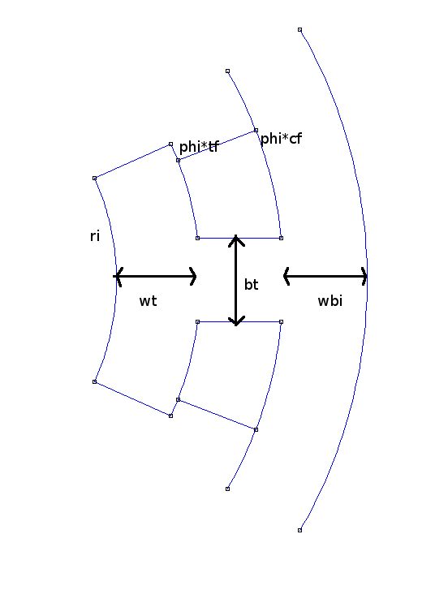
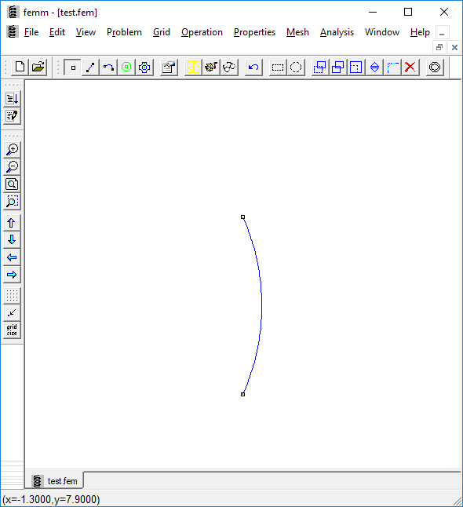
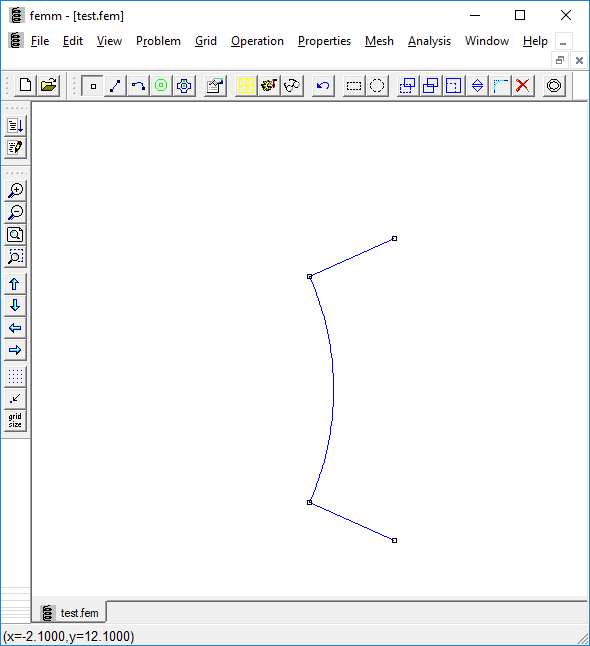
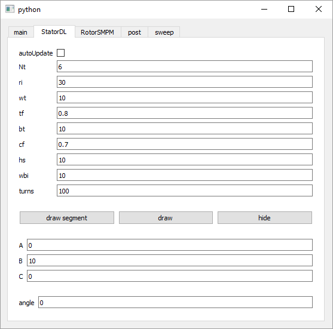
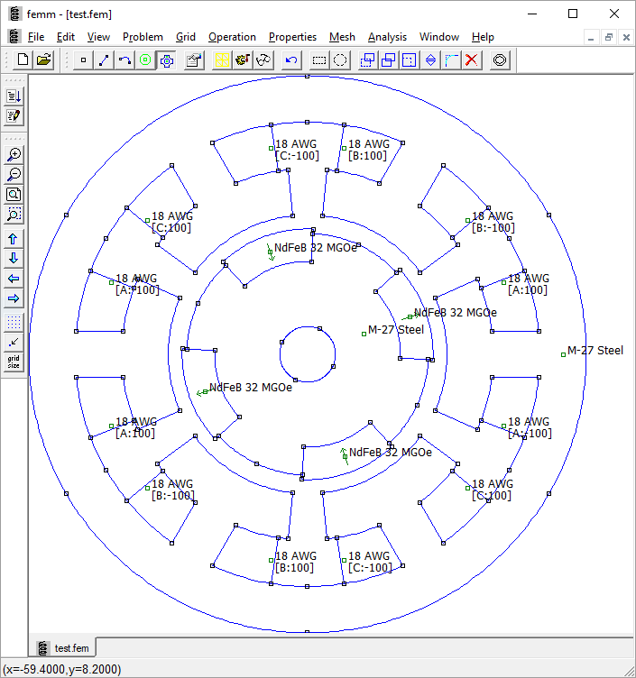
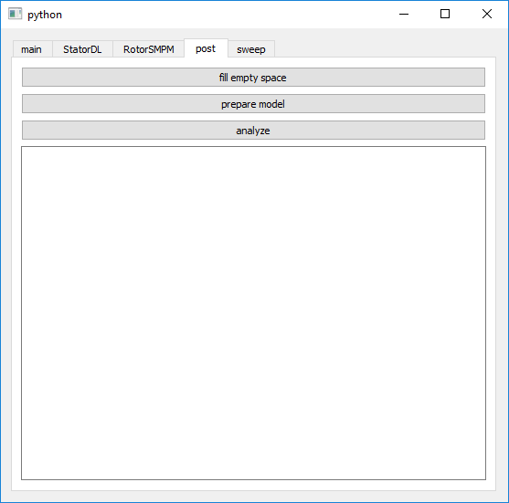
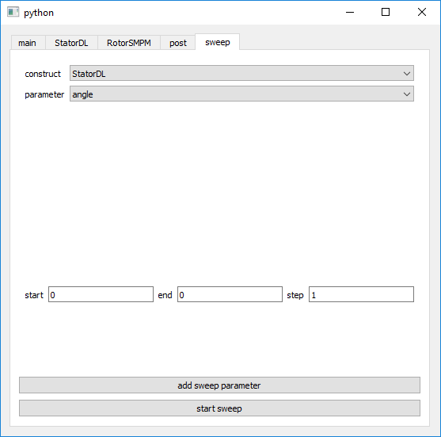
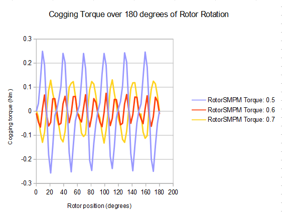

### Rapid Parametric Design & Characterization of Electric Machines Using A pyFEMM Based Toolset

### Graydon Wilson

### Draft

### Abstract
This paper presents a generalized method for modeling a magnetic machine using
open source pyFEMM utilities. The objective is to demonstrate a process which
minimizes design time by defining motor geometry parametrically, then rapidly
modifying or sweeping those parameters without the need to modify any code.
First, a basic permanent magnet synchronous machine (PMSM) is modeled using this
heuristic, and the software tools are used to demonstrate fine-tuning the
design. Then, the response of cogging torque to a single geometric parameter is
shown, to demonstrate automatic sweeping of motor geometry for easy parametric
design.

### Introduction
Finite element analysis (FEA) tools are employed regularly in the design of electric
machines. Of the available software, Finite Element Method Magnetics (FEMM) is
appreciated for being open source, lightweight, and free. FEMM appears regularly
in literature regarding electric machine design [1-3], likely due in part to its
low barrier of entry. Srisiriwanna and Konghirun [3] demonstrate use of FEMM to
study how cogging torque varies with motor geometry for a brushless DC motor.
Raja and Sudha [2] demonstrate design of a linear induction motor using FEMM,
using various algorithms to improve performance via geometric parameters.
Similarly, Phuangmalai, Konghirun, and Chayopitak [1] algorithmically modify the
geometry of a motor to optimize for particular performance metrics. 

Algorithmic development of motor geometry is frequent in literature which does
not invoke FEMM or other FEA tools as well. Kreim and Schäfer [4] optimize a
small parameter space for the layout of a PMSM. Babr [5] shows a parameter study
of a number of similar motors based on physical size restrictions, as part of an
optimization process.

The common thread among these papers is the small-scale modification of motor
geometry with respect to practical limits in the process of designing for
specific performance characteristics. This suggests the usefulness of a tool
which simplifies this process. A tool has been developed which, rather than
implement a specific algorithm, seeks to allow the engineer to make these
modifications rapidly by hand and observe the response in real time before
running longer simulations.

The tool is a software library which extends the existing pyFEMM library. Its
two primary functions are to simplify the programatic drawing of FEMM models,
and to offer a graphical user interface for modifying the model. The latter
bypasses the need to rerun the pyFEMM script in order make changes. The library
is written so as to be compatible with arbitrary designs, so long as some basic
guidelines are followed while writing the design script. How to write along
these guidelines is discussed in the following section.

### Design

As demonstration, a simple PMSM is designed, similar to Kreim and Schäfer [4]. Figure 1 shows
how the machine stator geometry can be defined using a small number of
parameters:

- Nt: total stator teeth
- ri: inner radius of stator
- wt: radial width of tooth surface
- bt: thickness of tooth in slot
- wbi: radial width of back iron
- cf: angle of coil windings, as fraction of phi=360/Nt
- tf: angle of tooth, as fraction of phi=360/Nt



To begin writing code for a machine geometry, start a new python file and import the
necessary libraries, as shown.

```
from Construct import Construct
import femmutil as fm
```


The skeleton of any construct is like so:

```
class StatorDL(Construct):
    class Parameters(Construct.ParameterBase):
        def __init__(self):
            super().__init__()
            # define geometry parameters

    def __init__(self):
        super().__init__()
        self.p = self.Parameters()

    def setup(self):
        # do setup

    def drawSegment(self):
        p = self.p
        # draw one segment

    def draw(self):
        # draw remaining segments

    @property
    def rInner(self):
        # calculate inner radius

    @property
    def rOuter(self):
        # calculate outer radius
```

The significance of each section is discussed in order. The complete class definition is included in Appendix A.

#### `class Parameters(Construct.ParameterBase):`

After `super().__init__()`, all of the geometry parameters should be defined here. For example, to define the number of teeth for the stator, write `self.Nt = 6`. It is not necessary to have the initial values be rational but it is recommended.

When all parameters are entered, the `Parameters` initializer should be of the form

```
super().__init__()
self.Nt = 6
self.ri = 30
...
```

So that they are parsed correctly by the user interface, materials and circuits included in this initializer should use classes defined in the Construct module. 

```
self.coilMaterial = Construct.Material('18 AWG')
self.windingA = Construct.Circuit('A')
```

#### `def __init__(self):`

This iniializer should not be changed from what is shown.

#### `def setup(self):`

The purpose of this function is to initialize all the required materials and circuits in FEMM. It is called automatically before anything is drawn in FEMM. To add a new material, call `fm.getMat('material')`. To add a circuit, call `fm.makeCircuit('circuit', current)`. For example:

```
def setup(self):
    fm.getMat('18 AWG')
    fm.makeCircuit('A', 0)
    fm.makeCircuit('B', 10)
    fm.makeCircuit('C', 0)
```

#### `def drawSegment(self):`

This function is called to actually draw a segment of the construct in FEMM. The behavior should be to find the location of all nodes in the segment as a function of the previously defined parameters, then draw the appropriate surfaces between them. Location of nodes is most easily found in polar coordinates for most machine designs. 

For example, the innermost surface of the stator (which abutts the air gap) consists of an arc between two nodes at radius `ri` and angle +/- `phi*tf/2`, where `phi` is the total angle occupied by single segment and `tf` is the fraction of that angle the tooth occupies. To draw this surface, add to `drawSegment`

```python
phi = 360/p.Nt # find angle of a single segment
fm.addNode(p.ri, phi*tf/2) # add one node in polar coordinates
fm.addNode(p.ri, -phi*tf/2) # add the other node
fm.addArc(p.ri, -phi*tf/2, p.ri, phi*tf/2) # draw arc between nodes
```



Note that in calling `addArc`, the clockwisemost polar coordinate should come
first so that the curve bends outward. It is not necessary to bypass pyFEMM
function calls in this way, but is convenient in this instance, as in most where
polar coordinates are more suitable than cartesian.


To draw the radial surfaces of the tooth, use the same procedure: determine the polar coordinates of the necessary nodes, then draw a line between them.

```python
r = p.ri + p.wt # r component of node positions
fm.addNode(r, phi*tf/2)
fm.addNode(r, -phi*tf/2)
fm.addLine(p.ri, phi*tf/2, r, phi*tf/2)
fm.addLine(p.ri, -phi*tf/2, r, -phi*tf/2)
```



The remaining surfaces should be drawn in the same manner.

#### `def draw(self):`

This function draws the entire construct once a single segment is drawn. For
simple designs, it is sufficient to simply revolve the segment around the
origin by calling `fm.revolve`. For this design, with `Nt` teeth, the function
should be:

```
def draw(self):
    fm.revolve(self.p.Nt, self.group)
```

If additional steps are required for finishing the construct drawing after it is revolved, such as adding unique block labels for coils or magnets, that should also be done in the `draw` function. 

#### `def rInner` and `def rOuter`

These are functions which should return the total inner and outer radius, respectively, of the construct in terms of its geometry parameters. This is used by the GUI to automatically determine regions of free space. In this example design, the inner radius is given by the parameter `ri`, and the outer region is given by the sum of parameters `ri + wt + hs + wbi`. 


```
    @property
    def rInner(self):
        return self.p.ri

    @property
    def rOuter(self):
        return self.p.ri + self.p.wt + self.p.hs + self.p.wbi
```

### Modifying a Construct

Once the class definitions are written for all the constructs of interest, they can be added to the FEMM utility by calling `register` with the name of the class and a unique group number. A complete script to register both demo constructs and start the UI is as follows:

``` python
from UI import FEMMUtil
from StatorDL import StatorDL
from RotorSMPM import RotorSMPM

fmutil = FEMMUtil()
fmutil.register(StatorDL, 1)
fmutil.register(RotorSMPM, 2)
fmutil.initUI()
```

After running the script, a window will appear. Press `connect FEMM` to open a FEMM instance and connect it to the tool. 

Construct parameters are automatically parsed and added to the interface as individual tabs. 



Three fields are automatically added to all construct tabs regardless of its set of parameters.

#### autoUpdate

The autoUpdate field toggles whether or not FEMM will update as parameter fields are modified, or wait until `draw segment` or `draw` is selected. While checked, the drawing as it appears in the FEMM window will update its geometry according to what is written in each parameter field.

#### draw, draw segment, hide

Three buttons are added to each construct tab which control the draw state of that construct. `draw segment` draws a single segment by calling the `drawSegment` function written for that class. `draw` draws the entire construct by calling `drawSegment` and `draw` functions in that order. `hide` clears that particular construct from the screen.

#### angle

The `angle` field controls the angle of the construct about the origin. The angle updates automatically in FEMM as this field is changed.



With these options, the geometry of the motor can be modified according to the defined parameters quickly before starting analysis.

### Analysis

The `post` tab allows the user to complete the model definition and extract measurements from the analysis.



Pressing `prepare model` automatically assigns an 'Air' material to any empty space in the design, then adds an asymptotic boundary condition. Press analyze to run analysis. 

### Sweep

The `sweep` tab allows any numeric parameters to be automatically swept through arbitrary bounds and data extracted at each analysis. To add a sweep directive, select the relevant construct, select the parameter to sweep, then set the start, end, and step options. Press `add sweep parameter` to register those options for the next sweep.



Any number of parameters can be modified in a single sweep: after the first parameter registered finishes its sweep, the second parameter is changed by its step value, and the first parameter runs the same sweep. For example, to determine how torque changes with air gap over a rotor revolution, the following two sweeps would be registered:

- Construct: RotorSMPM
- Parameter: angle
- start = 0, stop = 180, step = 1

- Construct: StatorDL
- Parameter: ri
- start = 30, stop = 32, step = 0.5

Adding parameters in this order will first rotate the rotor by 180 degrees, then increase the stator inner radius by 0.5 units, then rotate the rotor by 180 degrees, and so on until the inner radius parameter reaches 32 units.

#### Sweep example

A sweep was performed which measured cogging torque with respect to stator tooth phase fraction tf. The two sweeps defined, in order, were as follows:

- Construct: RotorSMPM
- Parameter: angle
- start = 0, stop = 180, step = 1

- Construct: StatorDL
- Parameter: tf
- start = 0.5, stop = 0.7, step = 0.1

Overlaid results for the three sweeps shown follow.



### Conclusion

pyFEMM offers a robust library for automatically generating motor geometry.
However, practical use can be simplified greatly with the addition of software
tools such as the one demonstrated in this paper which build on top of the core
library. A general method has been demonstrated for easy characterization of a
single performanace specification as geometry is changed programatically. The
same method should apply to a variety of characterizations, and on machines with
a wide variety of geometries.

### References

[1] W. Phuangmalai, M. Konghirun and N. Chayopitak, "A design study of 4/2 switched reluctance motor using particle swarm optimization," 2012 9th International Conference on Electrical Engineering/Electronics, Computer, Telecommunications and Information Technology, Phetchaburi, 2012, pp. 1-4.

[2]  C. V. N. Raja and K. R. Sudha, “Optimal Design of Equivalent Linear Induction Motor Based on Taguchi Algorithm and Analysis Using Finite Element Method,” International Journal on Electrical Engineering and Informatics, vol. 9, no. 3, pp. 603–615, 2017. 

[3] T. Srisiriwanna and M. Konghirun, "A study of cogging torque reduction methods in brushless dc motor," 2012 9th International Conference on Electrical Engineering/Electronics, Computer, Telecommunications and Information Technology, Phetchaburi, 2012, pp. 1-4.

[4]  A. Kreim and U. Schafer, “An approach to an optimal design of permanent magnet synchronous machines for battery electric vehicles,” 2013 World Electric Vehicle Symposium and Exhibition (EVS27), 2013. 

[5] S. M. Bar, “Design of PM Motors With Concentrated Windings for
Concrete Cutters,” M.S. thesis, Royal Inst. Technol., Stockholm,
Sweden, 2007.

##  Appendix A: StatorDL Class Definition

```python
class StatorDL(Construct):

    class Parameters(Construct.ParameterBase):
        def __init__(self):
            super().__init__()
            self.Nt = 6     # number of teeth
            self.ri = 30    # inner radius
            self.wt = 10    # width of tooth
            self.tf = 0.8   # tooth fractional phase
            self.bt = 10    # root thickness
            self.cf = 0.7   # coil fractional phase
            self.hs = 10    # height of slot
            self.wbi = 10   # width of back iron
            self.turns = 100 # coil windings
            self.statorMat = Construct.Material('M-27 Steel')
            self.coilMat = Construct.Material('18 AWG')
            self.coilA = Construct.Circuit('A', 0)
            self.coilB = Construct.Circuit('B', 10)
            self.coilC = Construct.Circuit('C', 0)
    
    def __init__(self):
        super().__init__()
        self.p = self.Parameters()

    def setup(self):
        fm.getMat(self.p.statorMat.matName)
        fm.getMat(self.p.coilMat.matName)
        fm.makeCircuit(self.p.coilA.circName, self.p.coilA.current)
        fm.makeCircuit(self.p.coilB.circName, self.p.coilB.current)
        fm.makeCircuit(self.p.coilC.circName, self.p.coilC.current)

    def sanitize(self):
        while(self.p.Nt % 3 != 0 or self.p.Nt < 1):
            self.p.Nt += 1
        self.p.ri = abs(self.p.ri)
        self.p.wt = abs(self.p.wt)
        self.p.tf = min(abs(self.p.tf), 1)
        self.p.bt = abs(self.p.bt)
        self.p.cf = min(abs(self.p.cf), 1)
        self.p.hs = abs(self.p.hs)
        self.p.wbi = abs(self.p.wbi)
        self.p.turns = abs(self.p.turns)

    def drawSegment(self):

        self.sanitize()

        p = self.p
        phi = 360. / p.Nt
        # Find tooth metal phase
        phiM = phi*p.tf

        # draw rotor-facing surface
        fm.addNode(p.ri, phiM/2)
        fm.addNode(p.ri, -phiM/2)
        fm.addArc(p.ri, -phiM/2., p.ri, phiM/2)

        # draw coil-facing surface
        phiRootInt = math.asin((p.bt/2)/(p.ri+p.wt)) * 180 / math.pi
        fm.addNode(p.ri+p.wt, phiRootInt)
        fm.addNode(p.ri+p.wt, phiM/2)
        fm.addArc(p.ri+p.wt, phiRootInt, p.ri+p.wt, phiM/2)
        fm.addNode(p.ri+p.wt, -phiRootInt)
        fm.addNode(p.ri+p.wt, -phiM/2)
        fm.addArc(p.ri+p.wt, -phiM/2, p.ri+p.wt, -phiRootInt)

        # Connect tooth surfaces
        fm.addLine(p.ri, phiM/2., p.ri+p.wt, phiM/2)
        fm.addLine(p.ri, -phiM/2., p.ri+p.wt, -phiM/2)

        # draw coil-facing stator surface
        r = p.ri + p.wt + p.hs
        phiRootExt = math.asin((p.bt/2)/r) * 180 / math.pi
        fm.addNode(r, phiRootExt)
        fm.addNode(r, phi/2)
        fm.addArc(r, phiRootExt, r, phi/2)
        fm.addNode(r, -phiRootExt)
        fm.addNode(r, -phi/2)
        fm.addArc(r, -phi/2, r, -phiRootExt)

        # Connect tooth to stator
        fm.addLine(p.ri+p.wt, phiRootInt, p.ri+p.wt+p.hs, phiRootExt)
        fm.addLine(p.ri+p.wt, -phiRootInt, p.ri+p.wt+p.hs, -phiRootExt)

        # draw back iron boundary
        r = p.ri + p.wt + p.hs + p.wbi
        fm.addNode(r, phi/2)
        fm.addNode(r, -phi/2)
        fm.addArc(r, -phi/2, r, phi/2)

        # draw coil surface
        r = p.ri + p.wt
        phiC = p.cf*phi
        fm.addNode(r, phiC/2)
        fm.addNode(r, -phiC/2)
        fm.addNode(r+p.hs, phiC/2)
        fm.addNode(r+p.hs, -phiC/2)
        if(p.cf > p.tf): # coil broader than tooth 
            fm.addArc(r, phiM/2., r, phiC/2)
            fm.addArc(r, -phiC/2., r, -phiM/2)
        elif(p.tf < p.cf): # tooth broader than coil
            fm.addArc(r, phiC/2., r, phiM/2)
            fm.addArc(r, -phiM/2., r, -phiC/2)
            # note no need for arc if tf == cf
        fm.addLine(r, phiC/2., r+p.hs, phiC/2)
        fm.addLine(r, -phiC/2., r+p.hs, -phiC/2)

    def draw(self):

        # Revolve StatorDL around origin
        fm.revolve(self.p.Nt, self.group)

        # Stator metal label
        r = (self.p.ri + self.p.wt + self.p.hs + \
		self.p.ri + self.p.wt + self.p.hs + self.p.wbi) / 2
        fm.addBlockLabel(r, 0)
        fm.setMat(r, 0, self.p.statorMat.matName)

        # Add coil labels
        phiStep = 360/self.p.Nt
        phiOfs = phiStep * self.p.cf - 2 
        r = (self.p.ri + self.p.wt + self.p.ri + self.p.wt + self.p.hs) / 2
        for i in range(int(self.p.Nt)):
            phi = phiStep * i
            circuit = chr(ord('A')+(i%3))
            n = fm.addBlockLabel(r, phi + phiOfs / 2)
            fm.setCircZ(n, self.p.coilMat.matName, circuit, self.p.turns)
            n = fm.addBlockLabel(r, phi - phiOfs / 2)
            fm.setCircZ(n, self.p.coilMat.matName, circuit, -(self.p.turns))

    @property
    def rInner(self):
        return self.p.ri

    @property
    def rOuter(self):
        return self.p.ri + self.p.wt + self.p.hs + self.p.wbi
```
